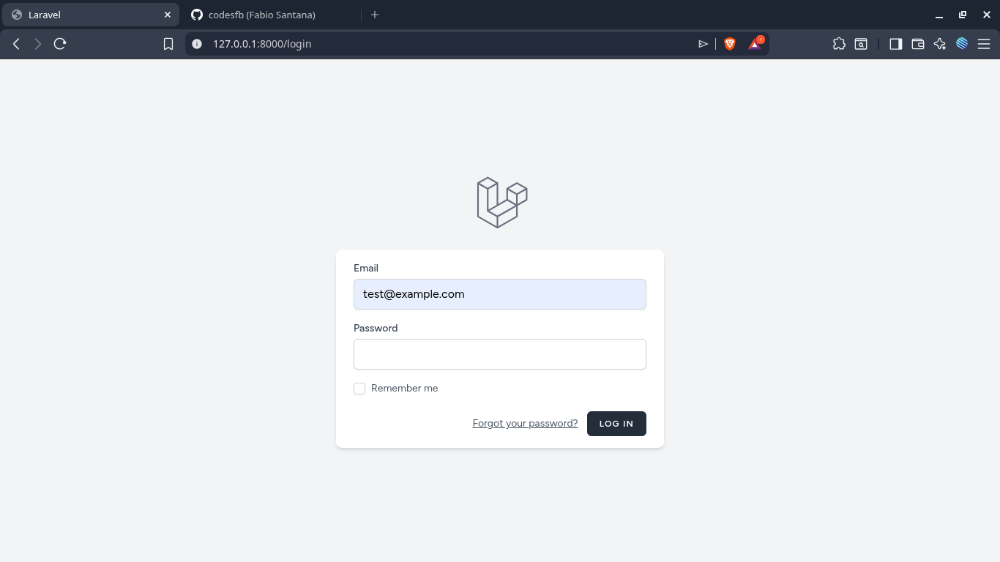

<p align="center">
  <a href="https://laravel.com" target="_blank">
    
  </a>
</p>

<p align="center">
  
  
  
  
</p>

# 📝 Task Manager Pro

Este é um projeto de **Gerenciamento de Tarefas** desenvolvido como parte dos meus estudos em desenvolvimento Web com PHP e Laravel. A aplicação permite que usuários organizem suas rotinas criando tarefas vinculadas a categorias personalizadas.


## 🚀 Funcionalidades

- **Autenticação Completa:** Sistema de login e registro seguro (Laravel Breeze).
- **CRUD de Tarefas:** Criação, leitura, atualização e exclusão de tarefas.
- **Categorias Dinâmicas:** Organize suas tarefas por categorias (Trabalho, Estudos, Pessoal, etc).
- **Status de Progresso:** Marque tarefas como concluídas ou pendentes com um clique.
- **Segurança de Dados:** Cada usuário visualiza e gerencia apenas seus próprios dados (Policies & Eloquent Scopes).

## 📸 Screenshots

Aqui estão algumas imagens do sistema em funcionamento:

<p align="center">
  
  
  
</p>

## 🛠️ Tecnologias Utilizadas

- **Framework:** [Laravel 11](https://laravel.com)
- **Frontend:** Blade Templates & [Tailwind CSS](https://tailwindcss.com)
- **Autenticação:** [Laravel Breeze](https://laravel.com/docs/11.x/starter-kits#laravel-breeze)
- **Banco de Dados:** MySQL / MariaDB
- **Ambiente:** Arch Linux (Rolling Release)

## ⚙️ Como rodar o projeto localmente

Siga os passos abaixo para configurar o ambiente em sua máquina:

1. **Clone o repositório:**
   ```bash
   git clone [https://github.com/seu-usuario/task-manager.git](https://github.com/seu-usuario/task-manager.git)
   cd task-manager